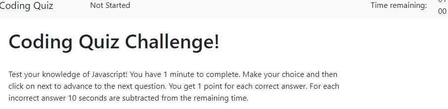
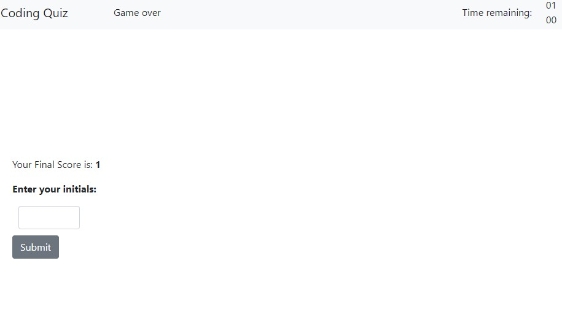
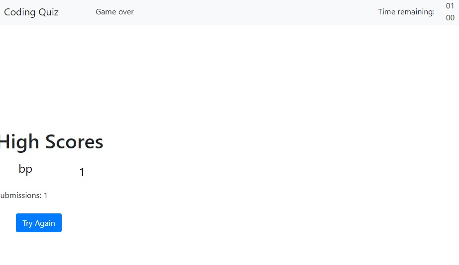

# web-apis-homework


# 04 Web APIs: Code Quiz


## Acceptance Criteria

```
GIVEN I am taking a code quiz
WHEN I click the start button



//This sets the timer at 1 minute, hides all the other sections, and displays the start screen.  

THEN a timer starts and I am presented with a question


// the timer starts, and presents the first question. I separated the answer selection from the move forward so you can review the question.  I had to disable the buttons so a person couldn't change their answer or get more points.  

WHEN I answer a question
THEN I am presented with another question


WHEN I answer a question incorrectly
THEN time is subtracted from the clock
// This takes off 10 seconds if you get a wrong answer and you don't get any points.   


WHEN all questions are answered or the timer reaches 0
THEN the game is over



// this shows the final score, and the submission.  
WHEN the game is over
THEN I can save my initials and score


//This part was really tricky.  I don't know if I got the storage correctly. I just used local.storage


